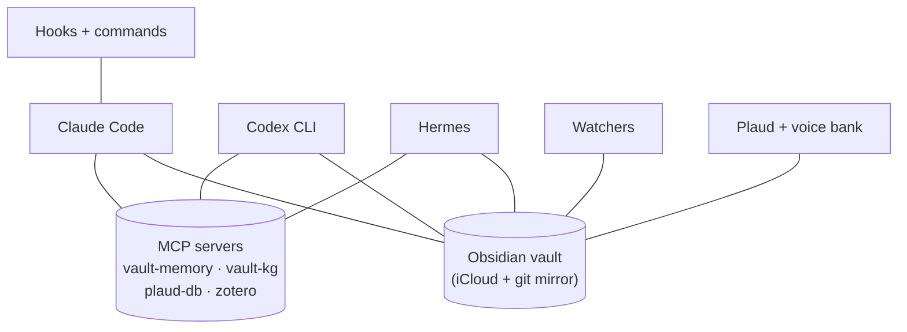
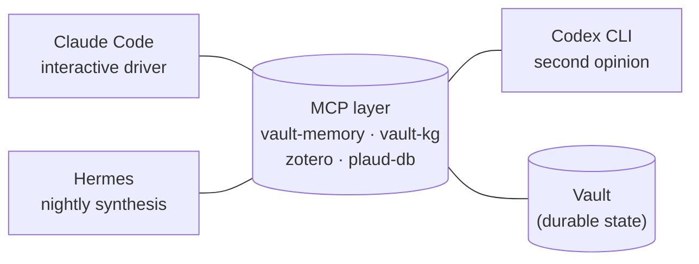

```
┌─────────────────────────────────────────────────────────┐
│                                                         │
│                  M Y B R A I N   O S                    │
│                                                         │
│       A personal operating system for a                 │
│              knowledge worker                           │
│                                                         │
│    Obsidian · Claude Code · Codex · Hermes · MCP        │
│            macOS-native rituals                         │
│                                                         │
└─────────────────────────────────────────────────────────┘
```

<p align="center">
  
  
  
  
  
  
</p>

---

## Table of contents

- [What this is](#-what-this-is)
- [Getting started with your own agent](#-getting-started--with-your-own-agent)
- [The system at a glance](#-the-system-at-a-glance)
- [Core patterns](#-core-patterns)
- [The multiagent model](#-the-multiagent-model)
- [Stack](#-stack)
- [Skills I lean on](#-skills-i-lean-on)
- [Who built this](#-who-built-this)
- [Inspirations & references](#-inspirations--references)
- [License](#-license)

---

## 📝 What this is

An Obsidian vault with three AI agents working over it through MCP servers, a set of lifecycle hooks, nightly synthesis runs, and macOS-native rituals built around Mail, Calendar, Notes, and Plaud audio. Not a framework. Not a productivity template. A personal OS for a knowledge worker: patterns I've found useful, packaged so you can fork and adapt the pieces that fit your stack, with an agent to walk you through it.

---

## ⚡ Getting started -- with your own agent

This isn't pip-install. It's adopt-with-an-agent.

```bash
gh repo clone yetiswang/mybrain-os
cd mybrain-os
claude       # or: codex, cursor, your-agent-of-choice
```

Then say:

> Walk me through this codebase and help me build my own version.

Your agent loads `AGENTS.md` and takes it from there: it asks
what you already have, walks the patterns with you in dependency
order, and helps you copy-adapt the pieces that fit your stack.
You decide what to keep, what to drop, what to rewrite.

See [`AGENTS.md`](AGENTS.md) for the full walkthrough protocol.

---

## 🗺 The system at a glance



---

## 🧩 Core patterns

| | |
|---|---|
| **Multiagent model** <br/> One vault, three agents, MCP-shared state. <br/> [`docs/02`](docs/02-multiagent-model.md) | **Hooks & skills** <br/> Lifecycle hooks that protect, classify, inject context. <br/> [`docs/03`](docs/03-hooks-and-skills.md) |
| **Knowledge wiki** <br/> LLM-as-compiler over Zotero and clippings. <br/> [`docs/04`](docs/04-knowledge-wiki.md) | **Meeting capture** <br/> Plaud, mlx-whisper, pyannote, voice bank. <br/> [`docs/05`](docs/05-meeting-capture.md) |
| **Vault sync** <br/> iCloud and git mirror, auto-commit launchd. <br/> [`docs/06`](docs/06-vault-sync.md) | **macOS rituals** <br/> AppleScript patterns for Mail, Notes, Calendar. <br/> [`examples/applescript`](examples/applescript/) |

---

## 🤝 The multiagent model

Three agents share one vault through a common MCP layer. Each has a distinct role: Claude Code drives interactive sessions in the foreground, Codex CLI is the second opinion you call for review or when you're stuck, Hermes runs nightly over the vault to synthesise the day and write a dream note.

What makes this work is that all three agents read and write through the same MCP servers. `vault-memory` gives any agent access to a privacy-filtered view of recent vault content. `vault-kg` exposes a SQLite property graph rebuilt nightly, so structural queries (who is bridging between two stakeholders, where are the knowledge gaps) are answerable from any session. `zotero` and `plaud-db` wire in the research library and the meeting transcript corpus.

The agents do not coordinate directly. They coordinate through the vault. A meeting note written by Claude Code during the day is visible to Hermes at 02:00 through `vault-memory`. An action item Hermes flags in a dream note is picked up by Claude Code the next morning via `/goodmorning`. The vault is the bus.

The key discipline: no agent owns a file class exclusively. Any agent can read anything. Write access follows conventions (meeting notes in `20-Work/Meetings/`, wiki in `10-Research/wiki/`), not locks.



| Agent | Role | Trigger |
|-------|------|---------|
| Claude Code | Interactive driver | Foreground sessions |
| Codex CLI | Second opinion (review, rescue) | On-demand |
| Hermes | Nightly synthesis | launchd 02:00 |

Full write-up: [`docs/02-multiagent-model.md`](docs/02-multiagent-model.md).

---

## 🧰 Stack

<p align="center">
  <a href="https://obsidian.md"></a>
  <a href="https://docs.claude.com/en/docs/claude-code"></a>
  <a href="https://github.com/openai/codex"></a>
  <a href="https://github.com/helixml/hermes"></a>
  <a href="https://modelcontextprotocol.io"></a>
  <a href="https://github.com/ml-explore/mlx-examples/tree/main/whisper"></a>
  <a href="https://github.com/pyannote/pyannote-audio"></a>
  <a href="https://support.apple.com/guide/mac-help/use-launchd-mh26836/mac"></a>
  <a href="https://support.apple.com/mail"></a>
  <a href="https://support.apple.com/calendar"></a>
  <a href="https://www.apple.com/notes/"></a>
  <a href="https://www.zotero.org"></a>
  <a href="https://www.plaud.ai"></a>
  <a href="https://www.sqlite.org"></a>
  <a href="https://www.trychroma.com"></a>
</p>

---

## 🧪 Skills I lean on

A snapshot of the Claude Code skills and plugins I depend on day-to-day,
beyond my own slash commands in [`examples/commands/`](examples/commands/).
Browse the broader catalogue at the [Claude Code plugin marketplace](https://docs.claude.com/en/docs/claude-code/plugins).

**Process & engineering**
- `superpowers:brainstorming` -- turn ideas into specs through dialogue (this README started here)
- `superpowers:writing-plans` -- break specs into bite-sized, executable tasks
- `superpowers:subagent-driven-development` -- fresh subagent per task + two-stage review
- `superpowers:systematic-debugging` -- deterministic feedback loop, falsifiable hypotheses
- `codex:rescue` -- hand off to Codex (GPT-5.x) for a second opinion, code review, or deeper diagnosis

**Writing & research**
- `writing` -- research-grade prose with verifiable citations
- `research-grants` -- grant-writing structure
- `peer-review` -- manuscript review
- `scientific-brainstorming` / `hypothesis-generation` -- early-stage research thinking
- `avoid-ai-writing` + `the-antislop` -- strip AI-isms from drafts before they ship
- `scientific-schematics` / `infographics` -- diagrammatic figures

**File handling**
- `markitdown` -- convert almost anything (PDF/DOCX/PPTX/XLSX/HTML/EPUB/YouTube) to clean Markdown
- `pdf` / `docx` / `pptx` / `xlsx` -- read/edit/produce office formats natively

**Design & build**
- `frontend-design` -- production-grade UI without AI slop
- `huashu-design` -- bilingual hi-fi prototyping with explicit anti-slop checklist
- `paper-2-web` -- turn academic papers into interactive sites

---

## 👤 Who built this

Built by **Yuyang Wang**, a research infrastructure manager at TU/e
(Eindhoven), leading [DiscoveryLabNL](https://discoverylabs.nl), a
national AI-driven materials discovery infrastructure for NWO LSRI 2027.

I needed an operating system for my work that didn't depend on any one
vendor staying alive or any one agent staying state-of-the-art. This
repo is that system, snapshot-published for anyone else building
something similar.

---

## 🙏 Inspirations & references

People and projects whose thinking shaped this.

- **Andrej Karpathy**: [LLM-as-compiler](https://x.com/karpathy/status/1882534525400137823) (the three-layer architecture in [`docs/04`](docs/04-knowledge-wiki.md)); [nanoGPT](https://github.com/karpathy/nanoGPT) and [llm.c](https://github.com/karpathy/llm.c) (the "build the smallest thing that works" discipline); [Software 2.0](https://karpathy.medium.com/software-2-0-a64152b37c35) (the framing that programs are increasingly weights, not code).
- **Garry Tan**: [garrytan.com](https://garrytan.com) and his [YouTube channel](https://www.youtube.com/@GarryTan1). His writing and talks on founder productivity, daily rituals, and structuring attention informed `/goodmorning` and `/5pmsummary`.
- **[My Brain Is Full Crew](https://github.com/gnekt/My-Brain-Is-Full-Crew)**: multi-agent Obsidian, file protection pattern.
- **[MemPalace](https://github.com/memorylabs-ai/mempalace)**: raw-verbatim AI memory.
- **[claude-mem](https://github.com/skydeckai/claude-mem)**: persistent memory for Claude.
- The wider community building personal knowledge infrastructure with LLMs. Too many to name. This repo is a contribution back.

---

## 📄 License

[MIT](LICENSE).
