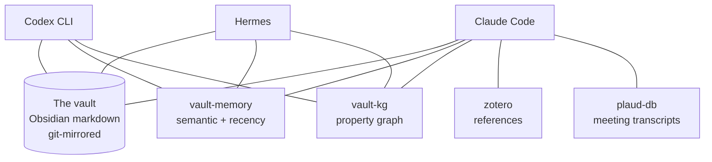

# The multi-agent model

One vault, three agents, shared memory through MCP. The reason to run multiple agents is not novelty. Each has its own session window and its own strengths, and they accumulate knowledge at different rhythms. The problem is that agents working in isolation diverge. When they all read and write the same vault through the same MCP servers, what one learns is available to the others by the next time they look. No messages, no coordination calls.

## The three agents

The system started as one agent. I added Codex when I noticed I was asking Claude to review code that Claude had also written, which is not a useful second opinion. I added Hermes when active state grew large enough that I needed something to notice patterns across a week, not just across a session. Each addition had a concrete reason; I stopped at three because three is enough.

The optional members are Antigravity, which covers science-domain workflows (biology databases, protein structures), and OpenCode, a shell-first alternate for days when I want a different execution model. Neither is core to the design. Each was picked for what it does well.

| Agent | Model | Role | Trigger |
|-------|-------|------|---------|
| Claude Code | Anthropic Claude (Opus / Sonnet 4) | Interactive driver. Most rituals, writing, vault edits. | Foreground sessions |
| Codex CLI | OpenAI GPT-5.x | Second opinion. Code review, rescue passes, deeper diagnosis. | On-demand via `/codex` |
| Hermes | Anthropic Claude (Sonnet) | Nightly synthesis. Reads recent vault state, writes the next morning's "dream". | launchd, 02:00 |

## What they share (and how)

Every agent reads and writes the same vault: a folder of Obsidian markdown files, iCloud-synced and git-mirrored every 30 minutes. State that does not fit in markdown, or benefits from structured queries, lives in four MCP servers that all agents can call.

The vault handles narrative: meeting notes, stakeholder files, project status, diary entries. The MCP servers handle retrieval that markdown is bad at: semantic similarity over thousands of notes, graph traversal across entities, full-text search over meeting audio. An agent working on a stakeholder question can ask vault-memory to surface related context from six months ago without scanning every file. An agent doing nightly synthesis can ask vault-kg which entities have gone quiet across the week.

## The MCP layer

**vault-memory** stores a searchable index over the entire vault, with a privacy filter for Dutch IBAN, BSN, KvK, and BTW patterns before any content leaves the file system. Five tools: `mem_search`, `mem_semantic_search`, `mem_get`, `mem_recent`, and `mem_list_memory`. All three agents use it. Claude Code calls it most during interactive sessions; Hermes calls it at the start of each nightly run to pull the past week's context.

**vault-kg** is a property graph rebuilt from the vault every night by a launchd batch job. The graph stores entities (people, projects, organisations, decisions) and the relations between them. Four tools: `kg_neighbors`, `kg_bridges`, `kg_capability_gap`, and `kg_cooling_decisions`. Claude Code and Hermes use it for questions like "which stakeholders appear together" or "what decisions have stalled in the past 30 days." Codex does not typically need it; Codex is doing code work.

**zotero** connects to a local Zotero library running on the same machine. It exposes search, add-by-DOI, note creation, and collection management. Claude Code uses it when working on literature review or ingesting new papers. Local-API mode means no cloud dependency and no rate limit beyond what Zotero itself imposes. Codex and Hermes rarely touch it.

**plaud-db** is a SQLite database with FTS5 indexing over meeting transcripts produced by the local Plaud capture pipeline. Three tools: `transcript_search`, `transcript_get_meeting`, and `transcript_list_meetings`. When I want to find what was said in a specific meeting two months ago, this is the query surface. Claude Code uses it during meeting note work and stakeholder updates. The transcripts themselves are not in the vault as markdown; they live in the database, which keeps the vault readable without massive text blobs.

See `examples/mcp-servers/` for the server implementations.

## Coordination: who writes what

**Claude Code writes:** meeting notes, stakeholder files, daily digest, weekly reflection, project files, code edits.

**Hermes writes:** `00-Inbox/dream-YYYY-MM-DD.md` (one file per night).

**Codex writes:** code only, into the watcher-scripts directory.

No two agents write the same file. This is the rule that makes the whole thing work. When agents share state by all reading a common ground truth but writing to distinct territories, conflicts disappear. I do not need a merge strategy or a write-lock protocol. The vault is the shared state; the coordination is expressed through which files each agent is allowed to touch. This is a constraint I set deliberately at the start, before any agent wrote anything. Re-establishing write territories after the fact is difficult.

## The dream loop

Hermes runs at 02:00 each night through a five-phase skill. Phase one: read the recent vault state, specifically the last seven days of meeting notes, diary entries, project files, and the dashboard. Phase two: cluster themes. What topics appeared across multiple days? What dropped off? What shows up in meetings but not in project files, or vice versa?

Phase three is synthesis: three to five paragraphs of pattern observation written in first-person, as if from my point of view looking back at the week. Not a summary of what happened. A reading of what it means. Phase four: write the output to `00-Inbox/dream-YYYY-MM-DD.md` with structured front matter including session date and health status. Phase five: log whether the run succeeded, partial, or failed, so the morning ritual can report on it.

The next morning, `/goodmorning` reads that dream file and folds its observations into the daily briefing. A pattern Hermes noticed at 02:00 surfaces in my priorities by 08:00. The two rhythms, nightly synthesis and morning planning, close into a loop.

## Why this works

Each agent stays inside what it is good at. Claude Code handles interactive, multi-turn sessions where context evolves in real time and I might ask to rewrite a paragraph, then check a stakeholder file, then draft an email. Codex handles review and adversarial passes where a different model and a fresh read are the value. Hermes handles slow synthesis when nothing is pulling at its attention: it reads everything from the week, thinks without interruption, and writes once.

The vault is the only durable state. No agent depends on another being running. If I stop using Hermes, Claude Code keeps working. If Codex updates to a new model, nothing breaks on the vault side. The models can change; the vault will still be readable in ten years. Agents are tools pointed at a stable substrate, not the substrate itself.

MCP is the seam. Adding a fourth agent or swapping a model means pointing the new thing at the same four MCP servers and giving it the same vault path. No re-architecture required. The seam has to be clean and documented, but it does not have to be rebuilt. That is the right property for infrastructure that lives under daily work.

## Build your own

Start with one vault, one agent, one MCP server. Get the semantic-search server working against your notes before you think about anything else. The single-agent version is already useful, and it will teach you what questions you actually want to ask before you commit to a more complex shape.

Add a second agent when you have a clear task split with a concrete reason. Interactive work versus review work is a good split. Interactive work versus nightly synthesis is a good split. "I want a second agent" is not a reason. Define what the second agent will write that the first does not, before you configure it.

Add nightly synthesis when your active state is large enough that you are regularly surprised by patterns you missed. For me that threshold was around 200 meeting notes and 50 active project threads. Below that scale, a weekly review ritual does the same job with less machinery.

Keep the rule that no two agents write the same file, and settle write territories before any agent touches anything. The question is simple: what does this agent write, and what is off limits? Answer it before the agent runs for the first time. Re-litigating write ownership after the fact is the most expensive kind of refactor this design can produce.
